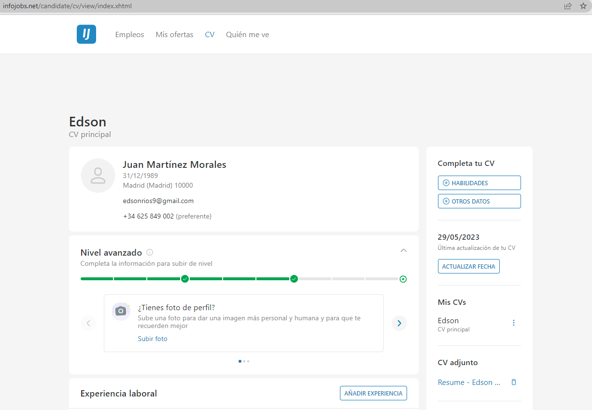
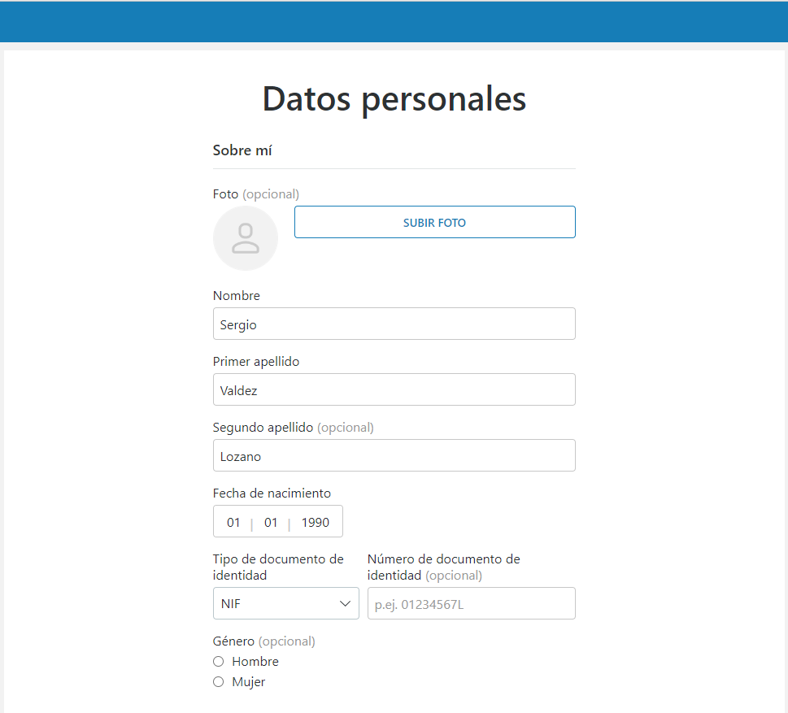
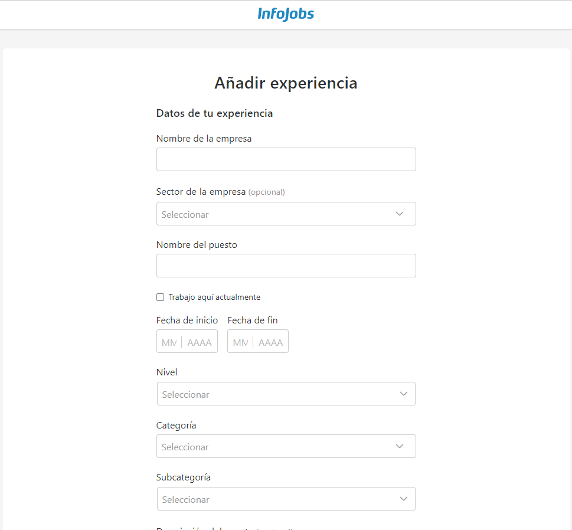
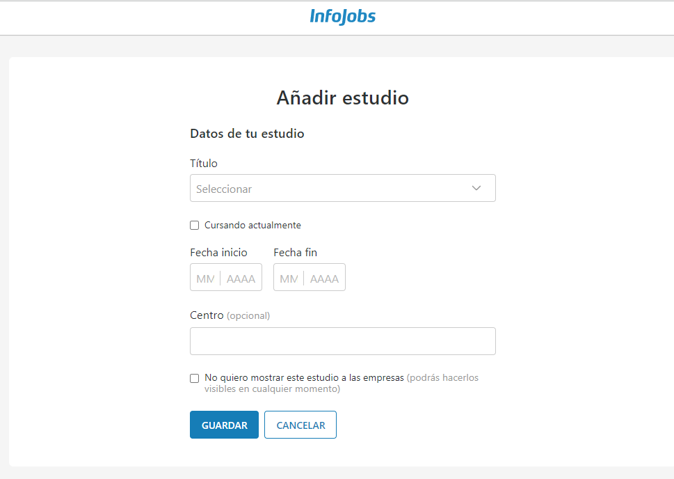
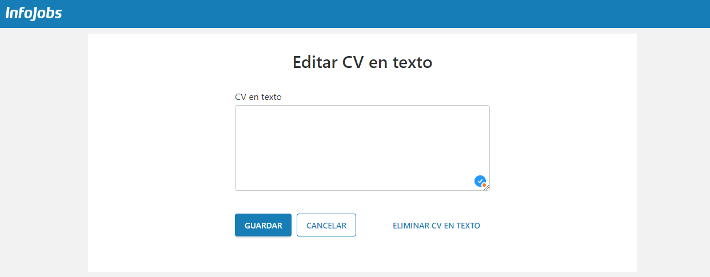
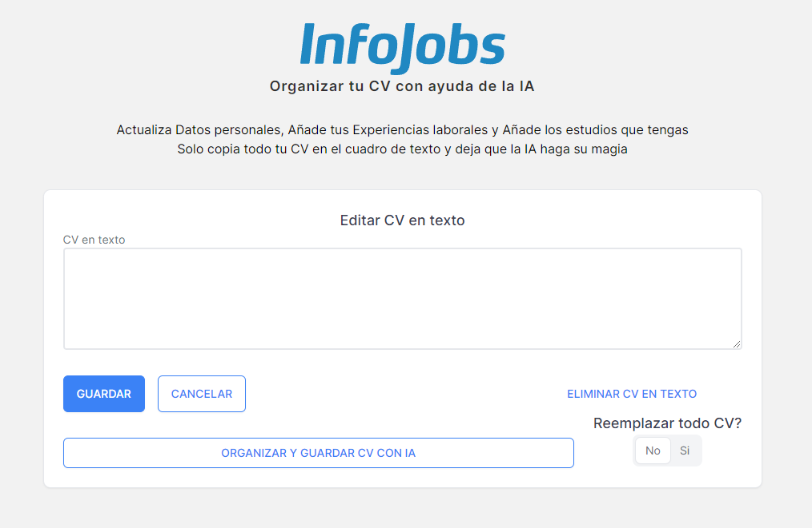
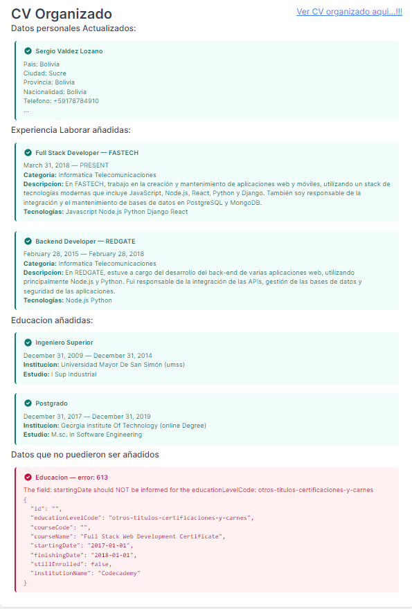

# Organiza tu CV con ayuda de la IA
[Deploy: Organizar CV con IA](https://organize-cv-with-ia-production.up.railway.app/)

Para fines de prueba, las variables de entorno estaran desactivados, y solo se activara el dia de las votacions en el canal de Midudev, eso para evitar costos exorbitantes en ChatGPT

## Variables de entorno

Necesitas tu archivo `.env.local` en la raiz del proyecto
```bash
INFOJOBS_TOKEN="Basic AAABBB, Bearer CCCDDD1123"
OPENAI_TOKEN="AABBBCCDDD"
```

## Obtener Infojobs Token
Para obtener el token de InfoJobs debes seguir la siguiente documentacion
https://developer.infojobs.net/

Lo mas importante a mencionar y que puede diferir entre los usuarios es el `SCOPE` de cada token, en nuestro caso es el siguiente:
```bash
SCOPE:
MY_APPLICATIONS,CANDIDATE_PROFILE_WITH_EMAIL,CANDIDATE_READ_CURRICULUM_SKILLS,CV,CANDIDATE_READ_CURRICULUM_EXPERIENCE,CANDIDATE_EDIT_CURRICULUM_EXPERIENCE,CANDIDATE_READ_CURRICULUM_CVTEXT,CANDIDATE_EDIT_CURRICULUM_CVTEXT,CANDIDATE_EDIT_CURRICULUM_EDUCATION,CANDIDATE_READ_CURRICULUM_EDUCATION,CANDIDATE_EDIT_CURRICULUM_PERSONAL_DATA,CANDIDATE_READ_CURRICULUM_PERSONAL_DATA,CANDIDATE_DELETE_CURRICULUM_EXPERIENCE,CANDIDATE_DELETE_CURRICULUM_EDUCATION
```

## Instalar
```bash
# install packages
pnpm install

# start dev mode
pnpm run dev
```

## Problematica del Projecto
El proyecto hace referencia a la informacion personal de cada candidato que esta en busca de trabajo y elije `Infojobs` para tan importante busqueda.

Infojobs tiene varias opciones que facilitan la busqueda de trabajo, compatibilidad del trabajo con tus skills, notificaciones en tu celular, empresas que buscan cierto perfil de habilidades y todo empieza por tus habilidades, pero estas habilidades solo pueden verse si llenamos adecuadamente todo nuestro CV en la pagina de `Infojobs`

Entonces en este proyecto nos enfocamos en el CV de cada candidato https://www.infojobs.net/candidate/cv/view/index.xhtml



Mas especificamente nos enfocamos en las areas de: `Datos Personales`, `Experiencia Laboral` y `Estudios`
https://www.infojobs.net/candidate/cv/cv-edit/edit.xhtml?fragment=personal-data
https://www.infojobs.net/candidate/cv/cv-edit/edit.xhtml?fragment=experience
https://www.infojobs.net/candidate/cv/cv-edit/edit.xhtml?fragment=studies-data




Añadir tus datos personales en los 3 formularios puede ser un poco complicado para alguien que entra por primera vez a la plataforma, porque en el caso de `Experiencia laboral` y `Estudios` debes llenar todo el formulario varias veces, segun cuanta experiencia y estudios tengas, entonces nuestra solucion sera evitarnos todos los pasos que convella esto para hacerlo todo con un solo boton

Para realizar esto nos enfocamos en la opcion de `Editar CV en texto`
https://www.infojobs.net/candidate/cv/cv-edit/edit.xhtml?fragment=text-cv-data


## Projecto

Nos enfocamos en el area de `Editar CV en texto` porque por esta area podemos manejar facilmente todo el cv en texto plano y procesarlo muy sencillamente, se podria utilizar la opcion de subir todo tu cv en un pdf o word, y de ahi leerlo, pero por ahora no se tenia acceso a ese endpoint, pero la idea es la misma

Esta es nuestra replica de `Editar CV en texto` con algunos botones agregados y explicaremos su funcion



### 1. Boton: "ORGANIZAR Y GUARDAR CV CON IA"
Esta es la funcion principal del proyecto y consta de 2 pasos, una vez que copies y pegues todo tu CV, sin importar el formato, en el cuadro de texto de `CV en texto`, entonces puedes pulsar el boton de `ORGANIZAR Y GUARDAR CV CON IA`, entonces enviara todo nuestro `CV` a ChatGPT para que pueda organizarlas bajo ciertos parametros ya definidos, y cuando retorne todos los datos requeridos, guardara todo en el CV de `Infojobs`

Adicionalmente, cuando se pulse el boton, se desactivara y mostrara el estado actual del proceso, que puede ser `ORGANIZANDO CV CON IA...` y luego pasara a `GUARDANDO CV...`

Al finalizar el proceso y si todo salio bien, podremos ver en un response los datos que fueron actualizados y añadidos

Puedes encontrar un ejemplo de CV al final de este doc



Podemos ver en color verde, todos los datos que pudieron ser actualizados y añadidos con exito

Por ahora solo puede organizar `Informacion Personal`, `Experiencia laboral` y `Estudos cursados` que se encuentren en el CV, en el futuro se puede añadir muchas mas cosas, solo se necesitaria acceso a los endpoints

Adicionalmente se puede observar en color rojo, los datos que no pudieron ser guardados y explicara la razon y tambien mostrara los datos que se trataron de enviar y fallo

### 2. Boton: "Ver CV organizado aqui...!!!"
Cuando finaliza la funcion de `Organizar y Guardar CV con IA` aparecera el boton de `Ver CV organizado aqui...!!!` que te redireccionara a la pagina de infojobs `https://www.infojobs.net/candidate/cv/view/index.xhtml` para verificar que los datos si se añadieron correctamente 

### 3. Opcion: "Reemplazar todo CV?"
Esta opcion nos permite borrar todos los datos previamente añadidos en el CV y reemplazarlos todos con los nuevos datos que nos dara la IA, ademas que añadira un paso adicional en la opcion de `ORGANIZAR Y GUARDAR CV CON IA` que sera `Limpieando CV...`

Por defecto esta opcion estara en `No` y permitira añadir todos los nuevos datos organizados con IA añadiralas con los que ya tienes, o si prefieres reemplazarlos todos

### 4. Boton: GUARDAR
Esta tiene la misma funcion que la funcion principal de infojobs, guarda directamente todo el CV en texto en Infojobs, sin realizar ningun procesamiento, solo mencionar que tiene algunas restricciones, como no debe estar tu nombre y tu correo o datos personales

### 5. Botones: CANCELAR Y ELIMINAR CV EN TEXTO
Estas opciones no tienen ninguna funcion, pero para pruebas, se añadio que el boton de `CANCELAR` mostrara una prueba de response, que se puede observar en colores verde y rojo, pero son datos falsos y el boton de `ELIMINAR CV EN TEXTO` borrara el response que se tenga, puede ser el verdadero o el falso, pero lo eliminara

## Tiempos
Finalmente se puede mencionar que el tiempo de cada proceso y esta detallado de la siguiente manera
```js
Funcion "Limpiar CV": 3 [s]
Funcion "Organizando CV con IA...": 50 [s]
Funcion "Guardando CV...": 3 [s]
```
Se menciona los tiempos para determinar de cierta manera si los procesos se estan realizando o si ocurrio algun error y se quedo solo esperando

## Ejemplo CV para usar
[Ejemplo de CV para usar](/example-doc/Resume%20-%20example.docx)